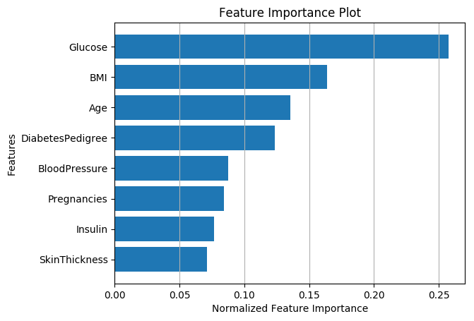
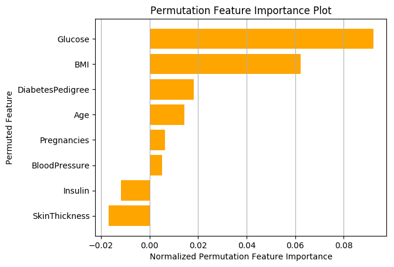
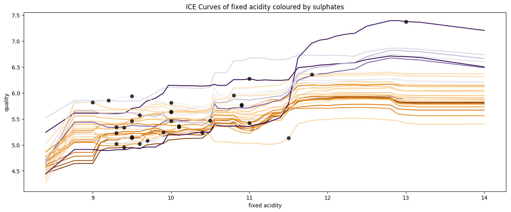
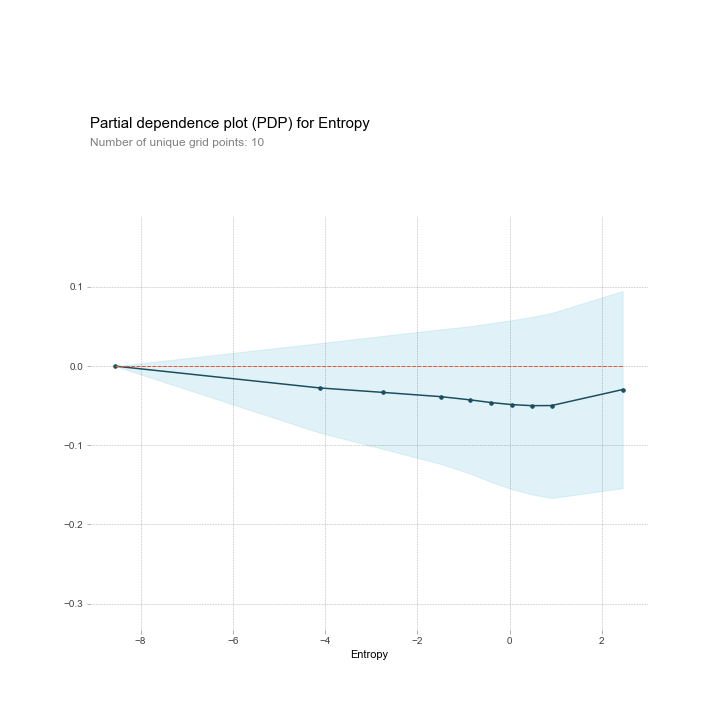
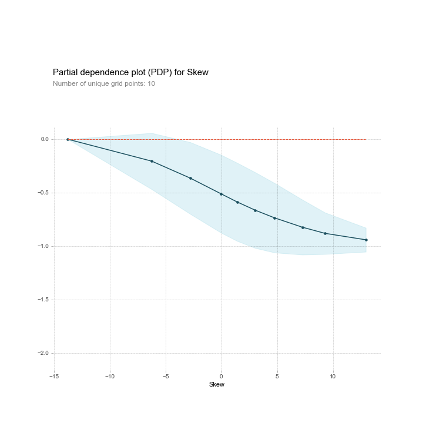
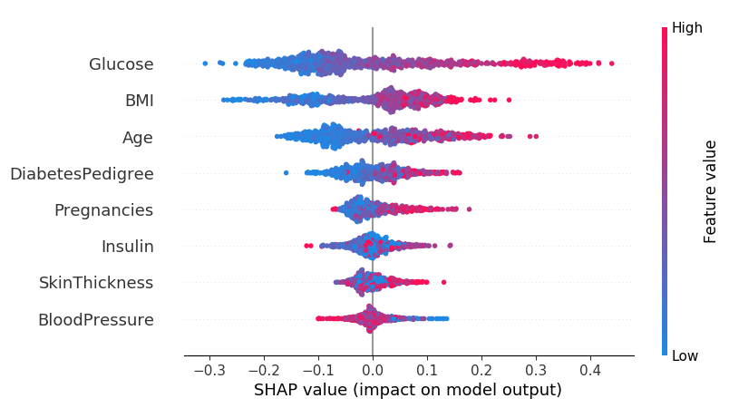
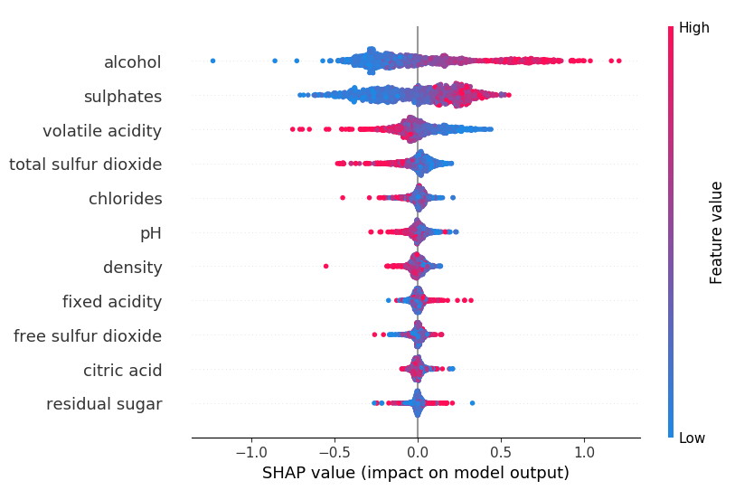
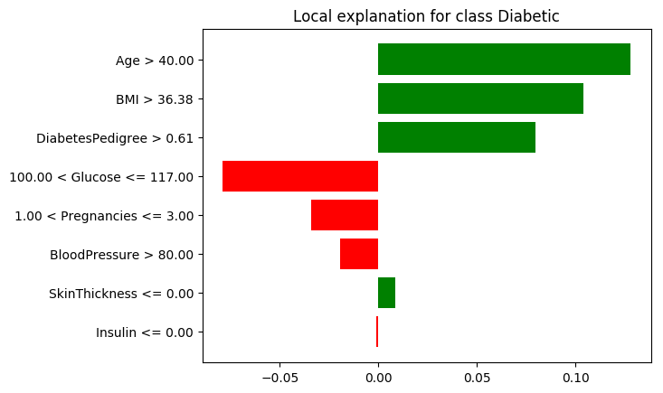
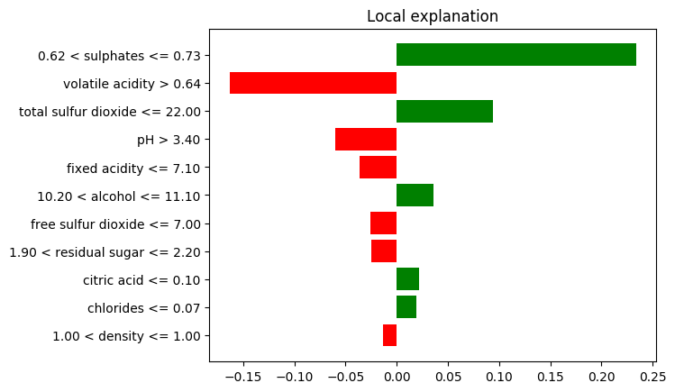

# eXplAIner
Steps and Explorations in Interpretable / Explainable AI

## Table of Contents
- [Feature Manipulations](#feature-manipulations)
- [Individual Conditional Expectations (ICE)](#individual-conditional-expectations)
- [Partial Dependence Plots (PDP)](#partial-dependence-plots)
- [Shapley Values](#shapley-values)
- [Local Interpretable Model-Agnostic Explanations (LIME)](#local-interpretable-model-agnostic-explanations)

The trained machine learning model will be referred to as the **underlying model**.

### Traditional Machine Learning Methods (Classification and Regression)
#### Feature Manipulations
The underlying model is run multiple times with different feature combinations, to get an estimate of the contribution of each feature.

A [`RandomForestClassifier`](https://scikit-learn.org/stable/modules/generated/sklearn.ensemble.RandomForestClassifier.html) (from `sklearn.ensemble`) is used as the underlying model for experiments on direct feature manipulations.

##### Feature Importance
This uses the [`feature_importances_`](https://scikit-learn.org/stable/auto_examples/ensemble/plot_forest_importances.html) attribute of the ensemble methods in Scikit Learn which is calculated by the _Mean Decrease in Impurity (MDI)_.

$ni_j = w_jC_j - w_{left(j)}C_{left(j)} - w_{right(j)}C_{right(j)}$ where
$ni_j = $ The importance of node $j$,
$w_j$ = The weight of samples reaching node $j$
$C_j$ = The impurity of node $j$
$left(j)$ = The child node from left split on node $j$
$right(j)$ = The child node from right split on node $j$

##### Feature Permutations
Here, for each feature in $(X_1, X_2, ..., X_n),$ the feature $(X_i)$ is **permuted** (values are shuffled randomly), the model is retrained and the mean drop in accuracy (MDA) is measured to ascertain the importance of the feature. This was also performed on the [Diabetes Dataset](https://www.kaggle.com/uciml/pima-indians-diabetes-database).

##### Feature Deletions
Here, for each feature in $(X_1, X_2, ..., X_n),$ the feature $(X_i)$ is **completely deleted**, the model is retrained and the mean drop in accuracy (MDA) is measured to ascertain the importance of the feature. This was done on the [Diabetes Dataset](https://www.kaggle.com/uciml/pima-indians-diabetes-database).

#### Individual Conditional Expectations
Individual Conditional Expectation (ICE) are a local per-instance method really useful in revealing feature interactions. 
They display one line per instance that shows how the instance’s prediction changes when a feature changes.

Formally, in ICE plots, for each instance in ${(x_S^{(i)}, x_C^{(i)})}_{i=1}^N$ the curve $\hat{f}_S^{(i)}$ is plotted against $(x_S^{(i)})$ while $(x_C^{(i)})$ remains fixed.

The $x_S$ are the feature vectors for which the ICE must be plotted and $x_C$ are the other features used in the underlying machine learning model $\hat{f}$.

In these examples, the underlying model $\hat{f}$ used is a [`RandomForestRegressor`](https://scikit-learn.org/stable/modules/generated/sklearn.ensemble.RandomForestRegressor.html)

Examples from the [Wine Quality Dataset](https://archive.ics.uci.edu/ml/datasets/wine+quality) are shown below.

#### Partial Dependence Plots
Partial dependence plots (short PDP or PD plot) shows the marginal effect one or two features have on the predicted outcome of a machine learning model.
A partial dependence plot can show whether the relationship between the target and a feature is linear, monotonic or more complex.

For regression, the partial dependence function is:
$\hat{f}_{x_S}(x_S) = E_{x_C}[\hat{f}(x_S, x_C)] = \int{\hat{f}(x_S, x_C)dP(x_C)}$
Again, $x_S$ are the feature vectors for which the ICE must be plotted and $x_C$ are the other features used in the underlying machine learning model $\hat{f}$ and the set $S$ which is usually small and consists only of one or two features.

The partial function $\hat{f}_{x_S}$ is calculated as follows:
$\hat{f}_{x_S}(x_S) = \frac{1}{n} \sum_{i=1}^n\hat{f}(x_S, x_C^{(i)})$

The partial function tells us for given value(s) of features $S$ what the average marginal effect on the prediction is.

The underlying model $\hat{f}$ used here is a shallow (1 hidden layer) Neural Network, an [`MLPClassifier`](https://scikit-learn.org/stable/modules/generated/sklearn.neural_network.MLPClassifier.html) with around 25 neurons in the hidden layer and the dataset used is the [`BankNotes Authentication Dataset`](https://archive.ics.uci.edu/ml/datasets/banknote+authentication).

#### Shapley Values
This idea comes from game theory and gives a theoretical estimate of feature prediction as compared to the above methods which were empirical and also gives importance to the sequence of features introduced.

The contribution of feature $i$ given the value function or **underlying model** $v$ is given as follows:

$\phi_i(v) = \sum_{S \subseteq (N \backslash \{i\})}\frac{|S|!(|N| - |S| - 1)!}{|N|!} (v(S\cup{\{i\}}) - v(S))$

where $S$ is a subset of the feature set $N$ and $v(S)$ gives the total model contribution of the subset $S$.

The underlying model $v$ used for this experiment is a [`RandomForestRegressor`](https://scikit-learn.org/stable/modules/generated/sklearn.ensemble.RandomForestRegressor.html) on the [Diabetes](https://www.kaggle.com/uciml/pima-indians-diabetes-database) and the [Wine Quality](https://archive.ics.uci.edu/ml/datasets/wine+quality) datasets.

<h5><ins>Diabetes Dataset</ins></h5>

<h5><ins>Wine Quality Dataset</ins></h5>

#### Local Interpretable Model-Agnostic Explanations
Local Interpretable Model-Agnostic Explanation (LIME) 
is a black-box **model agnostic** technique, which means it is independent of the underlying model used. It is however, **local** in nature, and generates an approximation and explanation for each example/instance of data. The explainer tries to perturb model inputs which are more interpretable to humans and then tries to generate a linear approximation _locally_ in the neighbourhood of the prediction.

In general,
$\xi(x) = argmin_{g \in G}\mathcal{L}(f, g, \pi_x) + \Omega(g)$
where $g(x)$ is the explainer function/model,
$\pi_x$ defines the locality/neighbourhood,
$\mathcal{L}$ defines the deviation or loss from the actual model $f$,
$G$ is the class/family of explainable functions

These are better illustrated by examples:
(Examples on the [Diabetes](https://www.kaggle.com/uciml/pima-indians-diabetes-database) and the [Wine Quality](https://archive.ics.uci.edu/ml/datasets/wine+quality) datasets)

Probability of being Diabetic: 0.56 
Prediction: Diabetic

Predicted Wine Quality: 5.8 / 10
